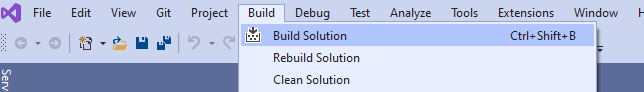
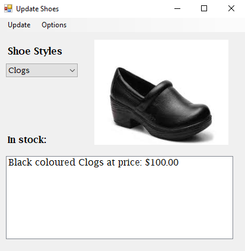
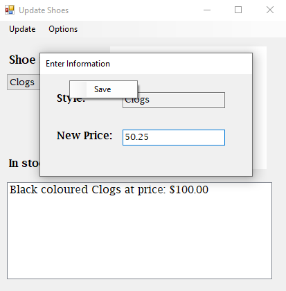
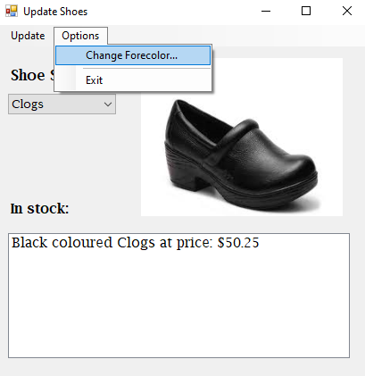

# Shoes Inventory

Allow user to select a shoe style, see the image, and details of the style selected.
In addition, user will be able to update the shoe price of the selected style
and change the text colour.

## Instructions

1. Clone the repository to your local machine.
2. Open the **ShoesInventory.sln** solution in [Visual Studio 2019 or latest](https://visualstudio.microsoft.com/)
3. Build the solution before starting the project
   

### Interacting with the app

1. Once starting the project, you will see the main form below, select a different shoe style from the list to see changes.
   
2. Click on the **Update** menu to change the price of a selected shoe style.
3. Right click anywhere on the update form to display a Context Menu to save any changes.
   
4. Click on the **Options** menu and select **Change Forecolor...** option to change the text colour of the shoe details.
   
